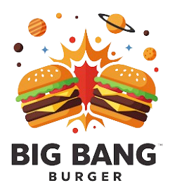

Website oficial da Big Bang Burger - Hamburgueria artesanal com os melhores sabores da cidade.

## 📌 Visão Geral

O Big Bang Burger é um projeto de website completo para uma hamburgueria artesanal, contendo:

- Página inicial com efeitos visuais atraentes
- Seção "Sobre" com informações da empresa
- Cardápio interativo com funcionalidade de carrinho
- Página de contato
- Localização com mapa integrado
- Chatbot simples para atendimento

## 🚀 Demonstração

Acesse o projeto em : [https://bigbangburger.vercel.app/](https://bigbangburger.vercel.app/)

## ✨ Funcionalidades Principais

### 🏠 Página Inicial
- Design moderno e responsivo
- Efeito de digitação animado
- Botão interativo com efeito "gooey"
- Navegação fluida

### 📋 Cardápio
- Listagem de produtos organizada por categorias
- Funcionalidade de adicionar ao carrinho
- Visualização do carrinho com itens selecionados

### 📍 Localização
- Mapa integrado
- Informações de endereço e horário de funcionamento

### 💬 Chatbot
- Interface simples para atendimento ao cliente
- Respostas automáticas para perguntas frequentes

## 🛠 Tecnologias Utilizadas

- **HTML5** - Estrutura semântica do site
- **CSS3** - Estilização avançada com animações
- **JavaScript** - Interatividade e funcionalidades dinâmicas
- **Tailwind CSS** - Framework CSS para design responsivo
- **Vercel** - Hospedagem e deploy contínuo

## 🎨 Design

- Paleta de cores principal: Preto e tons terrosos (#d4a373)
- Tipografia moderna
- Efeitos visuais suaves e profissionais
- Totalmente responsivo (mobile, tablet e desktop)

### 📞 Contato
**Gostou do projeto?**  
Entre em contato para conversarmos sobre desenvolvimento web personalizado!
```yaml
Desenvolvedor: "Felipe Botelho"
E-mail: "felipeaparecido.dev@gmail.com"
Localização: "Rio de Janeiro, Brasil"
Disponibilidade: "Freelance & Projetos Personalizados"

   
